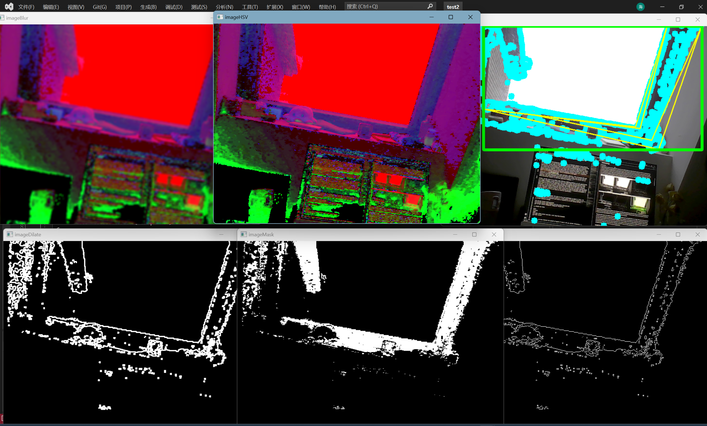

# Formula 1 video-record tracking system
This is the Formula 1 video-record tracking system project of team 22, ENG5220: Real Time Embedded Programming (2022-23) of University of Glasgow. 
## Contents
- [Formula 1 video-record tracking system](#formula-1-video-record-tracking-system)
  - [Contents](#contents)
  - [Background](#background)
  - [Contributor](#contributor)
  - [Features](#features)
  - [Methodology](#methodology)
    - [Detection](#detection)
  - [Install \& Guidance](#install--guidance)
    - [OpenCV Installation](#opencv-installation)
    - [WiringPi Installation](#wiringpi-installation)
    - [Video Streaming Installation](#video-streaming-installation)
  - [Train Your Own Model](#train-your-own-model)
    - [1.Make Dataset](#1make-dataset)
    - [2.Train](#2train)
- [Reference](#reference)
## Background
In Formula-1 match, it is always a challenge to keep a steady track on the target for a photographer holding his camera by hand. This project develops a system installed on ground or drones to tracking the cars with the help of raspberry, and the servo motors. This can also be used on other object tracking situation, like rocket launching record.<br>
In this project, a Raspberry 4B will be used as main control unit. C++ is mainly used in this project.
## Contributor
This project's development thanks to these contributors<br>  
|Name|ID|Module|
|------|------|-------|
|[Haihang Xia](https://github.com/Haihang-Xia)| *2743062X*| Detect|<br>
|[Yuge Wang](https://github.com/Cecilia-Yuge-Wang) |*2809017W*| Detect|<br>
|[Minghao Xuan](https://github.com/Ranger5120) |*2782500X*| Control|<br>
|[Chengjia Yu](https://github.com/CHENGJIA-YU)|*2780667Y*| Control|<br>

## Features
This system includes three parts. A camera installed on the platform driven by two motors is used to capture the video and send it back to raspberry. The raspberry deals with the tracking algorithm and gives instruction to the servo motors, to achieve the tracking process.<br>
<br>
The video can be transmitted to the cellphone, iPad, or laptop etc..Only needs to be able to connect with WiFi.<br>
The system can switch between manual target selection and automatic target selection.<br>

>**WIP: Xbox Controller controlling**<br>
>This is a work in progress planning. We hope to use an Xbox controller (Playstation, NS controller and etc...) to control the camera platform rotating and lock on in manual mode. However, this is only a WIP planning. **It may be cancelled due to the final result and timetable.**<br>
## Methodology

### Detection
Regarding the real-time monitoring of F1 racing cars, we initially adopted an edge detection approach. At first, we used the Canny function in OpenCV for edge detection. We read each frame of the image from the camera in real-time, then processed it through grayscale conversion, Gaussian blur, and other filters, before using the Canny function for edge detection. However, the results were very unsatisfactory, as the image could only detect partial lines when there was too much noise reduction, and the image became very cluttered and difficult to detect the desired target when there was too little noise reduction. Moreover, there was a significant amount of environmental interference. This is illustrated in the figure.

Afterwards, we adopted another method, color detection. Similarly, after processing with some filters, we used HSV quantization to select the desired color range, which was then used for detection. This method achieved certain results and was able to detect the desired race car model effectively. However, it still had significant drawbacks.<br>

Firstly, the HSV values of an object under different lighting conditions can vary significantly in an image. Although a console can be set up to constantly adjust the filtering HSV values, this method is inefficient and cumbersome. Secondly, when shooting different race cars, the paint colors of each car may differ, requiring constant changes to the HSV values. Moreover, typically, a car has large areas of the same color, but in some cases, the paint job may consist of many small color blocks of different colors, which would cause the HSV-based color detection to fail. Therefore, using HSV values for color detection can work in simulated environments to recognize objects, but it is not ideal for practical applications.This is illustrated in the figure.


Subsequently, we started exploring alternative methods beyond traditional image processing. First, we came across the conventional method of Haar cascades. Haar cascades are a machine learning-based object detection technique that uses features derived from image intensities to identify objects. Specifically, it involves training a classifier on a set of positive and negative images to detect the object of interest. However, Haar cascades have several drawbacks. For instance, they are struggle to detect objects under varying lighting conditions or occlusions. In addition, Haar cascades can only be trained for a specific type of race car, which limits their applicability to other types of cars and reduces their overall generalizability.<br>

Therefore, we sought to implement object detection through training neural network models. Neural networks have several advantages over Haar cascades. For instance, they can learn more complex features automatically, can handle large variations in object appearance, and are generally more accurate. Additionally, deep neural networks, such as convolutional neural networks (CNNs), have become the state-of-the-art in computer vision tasks, including object detection. By leveraging pre-trained CNN models, we were able to achieve high levels of accuracy in detecting F1 cars in real-time.<br>

Incorporating neural network models into the image recognition process provides several advantages. Firstly, neural network models are generally more accurate and reliable than traditional methods. Secondly, they can avoid recognition interference caused by different environmental factors. Neural network models can be trained to recognize multiple types of objects simultaneously, thereby increasing the model's generalizability. When photographing race cars, a neural network model can be trained to recognize each type of car on the track, allowing for the identification of all cars in a race and enabling the selection of specific cars for photography.<br>
## Install & Guidance
### OpenCV Installation
This project needs to use OpenCV. You need to set up the environment of OpenCV at first. The following steps will guide you how to make it. in this project, the openCV's version we use is 4.7.0. The Raspberry 4B is installed with system of Raspberry Pi OS with desktop (32-bit)<br>
1. Install dependent package
```
sudo apt-get install build-essential
sudo apt-get install cmake libgtk2.0-dev pkg-config libswscale-dev
sudo apt-get install libjpeg-dev libpng-dev libtiff-dev
```
2. Compile the files
```
mkdir
cd build
cmake ..
sudo make //this process may take a very long time bruhhhhhh
sudo make install
```

After this, you have finished the install of OpenCV if there's not any mistake information.<br>
<br>

### WiringPi Installation
In this project, GPIO would be used to control the servo motors. WiringPi Library is used in this project. Follow the steps below would setup the WiringPi. <br>
>As WiringPi official anounced, the WiringPi is **PRE-INSTALLED** with standard Raspbian systems, and official download source is not available anymore. So a third-party source would be used in this instruction.<br>
1. Checking if you have had the library.  
```
gpio -v
```
If you receive an output of version information about the GPIO, then you have had the library. just ignore the instruction if you know what to do.<br>

2. clone the repositories
```
git clone https://github.com/WiringPi/WiringPi.git
```
3. compile the source file
```
cd WiringPi
git pull origin
./build
```
Wait until the information of finishing the building process, and use 
```
gpio -v
```
to check library information, and use 
```
gpio readall
```
to draw a table of all the pinout.
<br>

### Video Streaming Installation
In this project, Flask would be used for the real-time video streaming. It captures the specific window called 'Camera' generated by main.cpp on the Linux system and streams it to the web broweser.<br>
1. Install required dependencies.
```
pip install opencv-python
pip install Pillow
pip install numpy
pip install Flask
```
2. Run the web server
```
python Server.py
```
Then visit the IP address given by the command line. All of the devices with the same wifi could visit it.
<br>

## Train Your Own Model
### 1.Make Dataset
The formation of this program's dataset is the same to darknet Yolo. I's still here to clarify.<br>
```
makedir Image
makedir Labels
```
Put all the picture in file Image, and each of the picture should correspond to a txt file. The txt file will store the data, the category number and coordinates of object  ("category cx cy wh") of the picture. <br>
For example:
```
0 0.539683 0.531746 0.582837 0.314153
1 0.435268 0.510251 0.625496 0.281085
2 0.524678 0.524636 0.389633 0.257606
```
This work can be done by labelimg.<br>

The next step is dividing this picture into two part, train file and val file. The ratio of the two parts is 8:2, the ratio can also be adjusted by yourself. I used a python script to do this, here for reference.<br>
```
import os
import random
import shutil

# Input file path and dation
src_dir = input("Please enter the path to the folder containing the image:")
ratio = float(input("Please enter the ration："))

# Output file path
train_dir = src_dir + "/train"
test_dir = src_dir + "/val"

if not os.path.exists(train_dir):
    os.makedirs(train_dir)
if not os.path.exists(test_dir):
    os.makedirs(test_dir)

image_paths = [os.path.join(src_dir, f) for f in os.listdir(src_dir) if f.endswith(".jpg")]

random.shuffle(image_paths)
split_index = int(len(image_paths) * ratio)

train_image_paths = image_paths[:split_index]
test_image_paths = image_paths[split_index:]

for image_path in train_image_paths:
    shutil.copy(image_path, train_dir)
for image_path in test_image_paths:
    shutil.copy(image_path, test_dir)

print("Done！")
```
Then put the image and label together in the same file.<br>
Formatting in folders:
```
.
├── train
│   ├── 0.jpg
│   ├── 0.txt
│   ├── 2.jpg
│   ├── 2.txt
│   ├── 3.jpg
│   ├── 3.txt
│   ├── 3.txt
│   └──......
└── val
    ├── 1.jpg
    ├── 1.txt
    ├── 78.jpg
    ├── 78.txt
    ├── 123.jpg
    ├── 123.txt
    └── ......
```
After that we need generate a dataset path .txt file, the example content is as follows：<br>
train.txt:
```
E:/Workspace/dataset/train/Ferrari_0.jpg
E:/Workspace/dataset/train/Ferrari_1.jpg
E:/Workspace/dataset/train/Ferrari_2.jpg
E:/Workspace/dataset/train/Ferrari_3.jpg
```
val.txt:
```
E:/Workspace/dataset/val/Mercedes-Benz_3.jpg
E:/Workspace/dataset/val/Mercedes-Benz_6.jpg
E:/Workspace/dataset/val/Mercedes-Benz_87.jpg
E:/Workspace/dataset/val/Mercedes-Benz_134.jpg
```
Then generate a txt file to put all classes in and save as .names file.For example:
```
Ferrari
Mercedes-Benz
RedBull
```
Finally put the class file, train.txt and val.txt in the same path.
```
.
├── train.txt
├── val.txt
├── class.names
├── train
│   ├── 0.jpg
│   ├── 0.txt
│   ├── 2.jpg
│   ├── 2.txt
│   ├── 3.jpg
│   ├── 3.txt
│   ├── 3.txt
│   └──......
└── val
    ├── 1.jpg
    ├── 1.txt
    ├── 78.jpg
    ├── 78.txt
    ├── 123.jpg
    ├── 123.txt
    └── ......
```
### 2.Train
In order to make the project is able to implement on the Raspberry Pi fluently and have a high fps in realtime webcamera. This project uses the open source model Yolo-FastestV2 from dog-qiuqiu.<br> 

This model is extremely simple and fast which is suitable for Raspberry Pi. If the hardware device has better performance, other models with higher accuracy, such as resnet, can be used.<br>
```
git clone https://github.com/dog-qiuqiu/Yolo-FastestV2.git
```
```
cd Yolo-FastestV2
```
```
cp -r ../dataset ./ 
```

```
python genanchors.py --traintxt ./dataset/train.txt
```
After that, we will get an genanchors6.txt file. For example:
```
//anchor bias
129.93,84.99, 132.55,143.29, 151.27,214.56, 198.98,115.59, 248.85,162.29, 258.30,206.14 
//iou
0.824518
```
Before train the model we need to make a file to record all the related data of the model.So we make a txt file, write done all this and save as f1.data file.
```
model_name= f1         # model name

epochs=300                # train epichs
steps=150,250             # Declining learning rate steps
batch_size=64             # batch size
subdivisions=1            # Same as the subdivisions of the darknet cfg file
learning_rate=0.001       # learning rate

pre_weights=None          # The path to load the model, if it is none, then restart the training
classes=3                # Number of detection categories
width=352                 # The width of the model input image
height=352                # The height of the model input image
anchor_num=3              # anchor num
anchors=129.93,84.99, 132.55,143.29, 151.27,214.56, 198.98,115.59, 248.85,162.29, 258.30,206.14  #anchor bias

train=../dataset/train.txt   # train dataset path .txt file
val=../dataset/val.txt       # val dataset path .txt file 
names=../dataset/class.names # .names category label file
```
Finally train the model:
```
python train.py --data f1.data
```
Calculate map evaluation:
```
python evaluation.py --data f1.data --weights modelzoo/f1model.pth
```


# Reference
https://github.com/dog-qiuqiu/Yolo-FastestV2